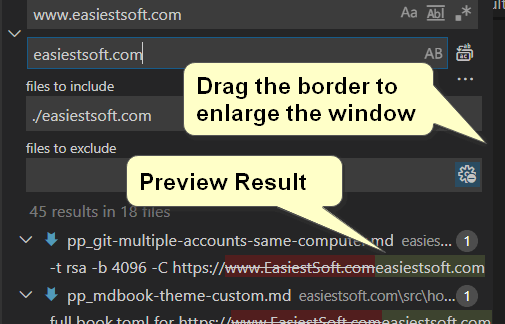

Best Search and Replace Text in multiple files Tool on Windows/Mac/Linux
===================

Find all files in a directory, replace text, preview results, optional regular expression mode - freeware _VS Code_

[Free Download (for Win, Mac, Linux)](https://code.visualstudio.com/download)
----------

Suppose you have the following folder structure:

> mybook/easiestsoft.com

And you want to replace text in files under the `easiestsoft.com` folder, processed as follows:

- Click the `Free Download` link on the page to download the free VS Code text editor, and install it
- Navigate to `mybook` folder in your PC, Right click on the `mybook` folder and select `Open with Code` (Please note we right-click on the **parent** folder of `easiestsoft.com`)

  

- Right click on `easiestsoft.com` in the left panel of VS Code, select `Find in Folder...`

  

- Now we can find and replace text in multiple files in a folder. The window consists mainly of 4 lines:
  - Search (Enter search text here)
  - Replace (Enter the text to be replace with)
  - files to include

    `./easiestsoft.com`
  - files to exclude

  

- Suppose you want to replace `easiestsoft.com` to `easiestsoft.com`

  

  It's amazing that you can preview the results of replacement. This is a very import feature, it prevents us from making mistakes

  The only problem is that the window is too small for us to see the full results. We can drag the border to enlarge the window

  Now we can clearly see the replacement results:

  

  If you want to see more clearly, you can click an item to view it in full window

- Perform `Replace All` after confirming preview results

  

Question time
------

- How to replace text in files with specific extension (for example, `.html`)

  files to include: `./easiestsoft.com/**/*.html`

  

- How to replace text in files with extensions `.html` or `.md`

  files to include: `./easiestsoft.com/**/*.html, ./easiestsoft.com/**/*.md`

- How to exclude specific folders from search, for example exclude `private` and `tmp` folder

  files to exclude: `./easiestsoft.com/**/private/, ./easiestsoft.com/**/tmp/`

  

- What does `**` and `*` mean in `./easiestsoft.com/**/*.html`

  There are called `glob pattern` (or wildcard) and are used by git (in [.gitignore](https://git-scm.com/docs/gitignore)) and other software, usually used to match paths

Search and Replace text in many files with Regex (Regular Expression)
---------------

- How to Search and Replace text in Regex mode

  Click `Use Regular Expression` icon to enable Regex Mode:

  

- How to remove space form the end of all lines using Regular Expression
  - Search: `\s+$`
  - Replace:

  

- How to remove `.` (period) from the end of all lines using Regex

  King Eca: For web text, there is no need to add `.` at the end of the line, because we usually separate lines with new lines. So adding `.` at the end of the line is like adding it to the beginning of the line, which is of course unnecessary

  I'm a philosopher and probably the greatest ever, and I train my self to avoid doing anything unnecessary. I remove all `.` at the end of lines of my text using Regular Expression:

  - Search: `(\w)\s*\.\s*$`
  - Replace: `$1`

  

  It seems I am the first person in the world to actively avoid such unnecessary thing

2019-12-15 by [King Eca](../../stars/a-king-eca/index.md)