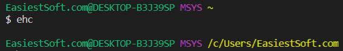

How to Run Linux Commands on Windows 10
=======

Can I run Linux commands on Windows? [Cygwin](https://www.cygwin.com/) is too heavy, [Git for Windows](https://git-scm.com/download/) is too light, freeware _MSYS2_ is a better choice

[Free Download (Windows XP above)](https://www.msys2.org/)
-----------

Download `msys2-x86_64-YYYYMMDD.exe` version if you have 64 bit Computer, otherwise select `msys2-i686-YYYYMMDD.exe`

I installed it on Windows 10, so I chose the x86_64 version

After downloading, I will set up the mirror site of MSYS2 in `C:\msys64\etc\pacman.d` directory because there are mirrors of MSYS2 near my location, you can usually skip this step

Install MSYS2 by following the guide at the download page

For the 64 bit version, the default location of the MSYS2 installation is `C:\msys64`

Basic usage of pacman (package manager for MSYS2)
-----------

Generally, Linux commands have some operations and options, each operation/option has a shorter version and a longer version

`pacman -Syu`, `S` is a shorter versions of a operation, `y` and `u` are shorter versions of two options. When you first saw it, did you know what it meant? Bad for beginners!

**The best tutorial is no tutorial required**, the command with the same effect but a longer version is `pacman --sync --refresh --sysupgrade` we can directly guess what it means

**Tutorials on the web should always show the longer version of command/operation**, while one can still use the shorter version at home

- Help for pacman:

      $ pacman --help
      usage:  pacman <operation> [...]
      operations:
          pacman {-h --help}
          pacman {-V --version}
          pacman {-D --database} <options> <package(s)>
          pacman {-F --files}    [options] [package(s)]
          pacman {-Q --query}    [options] [package(s)]
          pacman {-R --remove}   [options] <package(s)>
          pacman {-S --sync}     [options] [package(s)]
          pacman {-T --deptest}  [options] [package(s)]
          pacman {-U --upgrade}  [options] <file(s)>

      use 'pacman {-h --help}' with an operation for available options

- Help for `--sync` operation:

      $ pacman --help --sync
      usage:  pacman {-S --sync} [options] [package(s)]
      options:
        -b, --dbpath <path>  set an alternate database location
        -c, --clean          remove old packages from cache directory (-cc for all)
        -d, --nodeps         skip dependency version checks (-dd to skip all checks)
        -g, --groups         view all members of a package group
                             (-gg to view all groups and members)
        -i, --info           view package information (-ii for extended information)
        -l, --list <repo>    view a list of packages in a repo
        -p, --print          print the targets instead of performing the operation
        -q, --quiet          show less information for query and search
        -r, --root <path>    set an alternate installation root
        -s, --search <regex> search remote repositories for matching strings
        -u, --sysupgrade     upgrade installed packages (-uu enables downgrades)
        -v, --verbose        be verbose
        -w, --downloadonly   download packages but do not install/upgrade anything
        -y, --refresh        download fresh package databases from the server
                             (-yy to force a refresh even if up to date)
            --arch <arch>    set an alternate architecture
            --asdeps         install packages as non-explicitly installed
            --asexplicit     install packages as explicitly installed
            --assume-installed <package=version>
                             add a virtual package to satisfy dependencies
            --cachedir <dir> set an alternate package cache location
            --color <when>   colorize the output
            --config <path>  set an alternate configuration file
            --confirm        always ask for confirmation
            --dbonly         only modify database entries, not package files
            --debug          display debug messages
            --disable-download-timeout
                             use relaxed timeouts for download
            --gpgdir <path>  set an alternate home directory for GnuPG
            --hookdir <dir>  set an alternate hook location
            --ignore <pkg>   ignore a package upgrade (can be used more than once)
            --ignoregroup <grp>
                             ignore a group upgrade (can be used more than once)
            --logfile <path> set an alternate log file
            --needed         do not reinstall up to date packages
            --noconfirm      do not ask for any confirmation
            --noprogressbar  do not show a progress bar when downloading files
            --noscriptlet    do not execute the install scriptlet if one exists
            --overwrite <path>
                             overwrite conflicting files (can be used more than once)
            --print-format <string>
                             specify how the targets should be printed
            --sysroot        operate on a mounted guest system (root-only)

How to start a program on Windows 10
----------

1. Press the `Windows` key
2. Then enter the program name you are searching for, here is `msys`
3. Press the up or down arrow key to select the best match (if needed), press `Enter` to start the selected program

Install new software via package manager `pacman`
--------

After starting MSYS2, enter the command:

    pacman --sync tar openssh unzip

MSYS2 Install MinGW32 or MinGW64
--------

Search for `gcc` (part of mingw)

    $ pacman --sync --search gcc

For installing MinGW32:

     $ pacman --sync mingw-w64-i686-gcc

For installing MinGW64:

     $ pacman --sync mingw-w64-x86_64-gcc

I (King Eca) have installed MinGW32 because I want to build software that can run on 32-bit Windows systems. Of course you can install both MinGW32 and MinGW64

pacman List installed packages:

    $ pacman --query

pacman search an installed package:

    $ pacman cd --query --search ssh

Adding `open MSYS Bash here` to right-click context menu on Windows
----

.reg file:

{{#include dl/open-msys-bash-here.reg}}

- If you have installed MSYS2 to `c:\msys64` like me, you can download [Open Msys bash here reg file](dl/open-msys-bash-here.reg) and...

- Save the .reg file to your desktop

- Double click/tap on the downloaded .reg file to merge it

- When prompted, click/tap on `Run`, `Yes` (User Account Control), `Yes`(Registry Editor), and `OK`(Registry Editor) to approve the merge

- You can now delete the downloaded .reg file if you like
- Download [Remove Open Msys bash here reg file](dl/remove-open-msys-bash-here.reg) if you want to remove the right-click context menu

For the meaning of the options `-msys`, `-here` and `-where`, you can check the file `C:\msys64\msys2_shell.cmd` for details

Make the integrated shell of Visual Studio Code to MSYS2 Bash
------

I installed Git for Windows before and selected Git Bash as the default shell for [VS Code](../../web/best-software-find-replace-text-in-multiple-files/index.md), here is my user settings.json:

    {
        "files.autoSave": "afterDelay",
        "files.eol": "\n"
        "terminal.integrated.shell.windows": "C:\\Program Files\\Git\\bin\\bash.exe"
    }

Now I uninstalled git for Windows and installed MSYS2, and my settings.json changed to (base on [this article](https://dev.to/yumetodo/make-the-integrated-shell-of-visual-studio-code-to-bash-of-msys2-5eao)):

    {
        "files.autoSave": "afterDelay",
        "files.eol": "\n",

        "terminal.integrated.shell.windows": "C:\\msys64\\usr\\bin\\bash.exe",
        "terminal.integrated.env.windows": {
            "MSYSTEM": "MSYS",
            "CHERE_INVOKING": "1"
        },
        "terminal.integrated.shellArgs.windows": [
            "--login"
        ],
        "terminal.integrated.cursorStyle": "line"
    }

Available values for `MSYSTEM` are: _MSYS_, _MINGW32_ or _MINGW64_, you can check the file `C:\msys64\msys2_shell.cmd` for details

How to set PATH environment for MSYS2
------------

When you start MSYS bash, you are in the `~` directory, what is `~`

`~` is the a abbreviation of your home directory, we can enter `pwd` to print current working directory, it should like `/home/EasiestSoft.com` (Replace EasiestSoft.com with your name)

It seems better to put our files in the `~` directory, because we can quickly switch to it via `cd ~/dir`

But your home directory in MSYS2 is different from your home in Windows. `~` in MSYS2 is `C:\msys64\home\EasiestSoft.com` in Windows, and your home directory in Windows 10 is `C:\Users\EasiestSoft.com`

Some Windows software place its binaries in your Windows home directory, for example, the package manager for the Rust programming language places binaries in the `C:\Users\EasiestSoft.com\.cargo\bin` directory

If we want to call the binaries placed in the `C:\Users\EasiestSoft.com\.cargo\bin` directory from MSYS2, we need to add `C:\Users\EasiestSoft.com\.cargo\bin` to the PATH environment of MSYS2

let's print the default PATH of MSYS2:

    $ echo $PATH
    /usr/local/bin:/usr/bin:/bin:/opt/bin:/c/Windows/System32:/c/Windows:/c/Windows/System32/Wbem:/c/Windows/System32/WindowsPowerShell/v1.0/:/usr/bin/site_perl:/usr/bin/vendor_perl:/usr/bin/core_perl

We add our custom path to `~/.bashrc` (Not ~/.profile)

    ~ $ vim ./.bashrc

Check the result:

    ~ $ source ./.bashrc
    ~ $ echo $PATH
    /usr/local/bin:/usr/bin:/bin:/opt/bin:/c/Windows/System32:/c/Windows:/c/Windows/System32/Wbem:/c/Windows/System32/WindowsPowerShell/v1.0/:/usr/bin/site_perl:/usr/bin/vendor_perl:/usr/bin/core_perl:/c/Users/EasiestSoft.com/.cargo/bin

Adding MSYS2 binaries to Windows PATH
-----------

If you want to call MSYS2 binaries from outside of MSYS2 bash, you need to add them to the Windows PATH environment variable

- Press Windows key on Windows 10
- Enter `envi`
- Select `Edit the system environment variables` then press `Enter` key
- Click on the `Environment Variable` button
- Double click on the `Path` Variable, Click `New`, add values (Fore reference only):
  - C:\msys64\usr\bin
  - C:\msys64\usr\local\bin
  - C:\msys64\mingw32\bin

Make links in MSYS2 home directory for quick access
------------

Some software is installed in the `C:\Users\EasiestSoft.com` directory by default, and we can link them in the MSYS2' s home director for quick access

First, [Add Shift + Right Click "Open command window here as administrator" Context Menu](https://www.tenforums.com/tutorials/59686-open-command-window-here-administrator-add-windows-10-a.html)

Open `C:\msys64\home\EasiestSoft.com` (Replace EasiestSoft.com with your name) In Explorer, Shift + Right-Click in the folder, select `Open command window here as administrator`:

Enter:

    mklink /J Dropbox C:\Users\EasiestSoft.com\Dropbox

Now we can:

  - `cd ~/Dropbox` to quickly access Dropbox folder
  - And `start .` to open the Dropbox folder from MSYS2 bash in Explorer

Another way is to define a command in `~/.bashrc` file, e.g. `alias ehc='cd /c/Users/EasiestSoft.com/Dropbox'` and then use `ehc` to change the current directory to Dropbox folder

Note that **you can safely delete a directory of the link type, but if you delete a file under that directory, the actual file will also be deleted**. Therefor, if MSYS2 is no longer needed, please manually delete the directory of the link type before uninstalling MSYS2 to avoid accidental data loss

Link SSH config files to MSYS2's home directory
-------

Usually we keep important files (for example ssh config file) in the cloud such as OneDrive or Dropbox, and link them to the folders that need them

    ~ $ mkdir .ssh
    cd .ssh

    # Open .ssh folder in Windows Explorer
    start
Then Shift + right-click in the folder, select `Open command window here as administrator`

    mklink config C:\path\to\your\clould\ssh\config

Enable color for `ls` command
------------

Search for a line in the `~/.bashrc` file containing the world `color` and uncomment the line by removing the character `#` at the beginning of the line

Enable Color for `pacman`
----------

Find `#color` in `/etc/pacman.conf` and replace with `color`

Links:

- <https://github.com/valtron/llvm-stuff/wiki/Set-up-Windows-dev-environment-with-MSYS2>
- <https://dev.to/yumetodo/make-the-integrated-shell-of-visual-studio-code-to-bash-of-msys2-5eao>
- <https://gist.github.com/magthe/a60293fe395af7245a9e>
- <https://www.tenforums.com/tutorials/59686-open-command-window-here-administrator-add-windows-10-a.html>
- <https://www.booleanworld.com/get-unix-linux-environment-windows-msys2/>

2019-12-19 by [King Eca](../../stars/a-king-eca/index.md)